# SQLite ETL-Query

The Seattle weather dataset used for this project can be found [here.](https://github.com/vega/vega/blob/main/docs/data/seattle-weather.csv)

### Project Overview
- ``Extract`` data from a csv data source
- ``Transform`` data when necessary
- ``Load`` data into a SQLite database
- ``Query`` SQLite database with a robust CLI

### CRUD Operations
``Create``
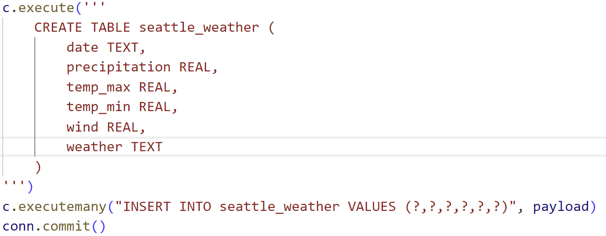
---
``Read``
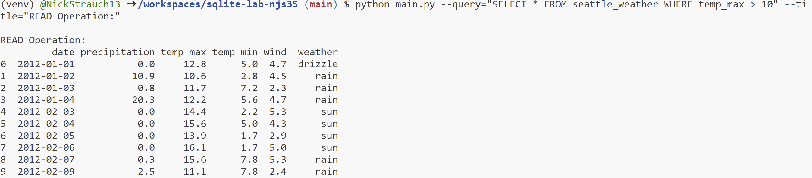
---
``Update``
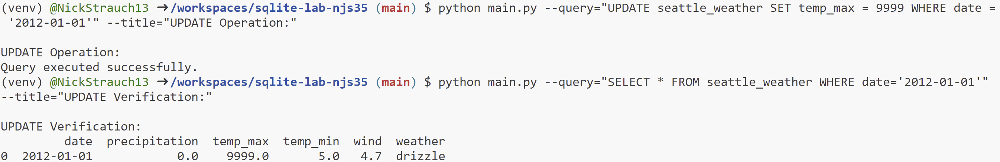
---
``Delete``
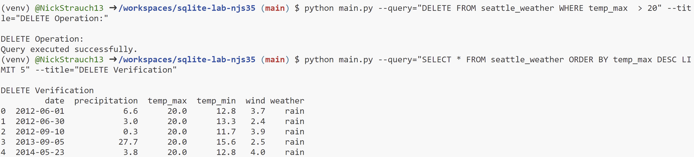
---

## Query Examples with the CLI
---
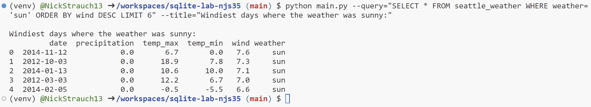
---
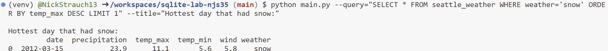
---
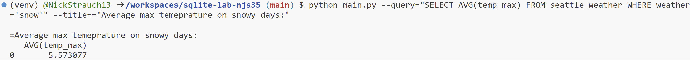
---

### Query Example with CRUD Operation Progress Printout
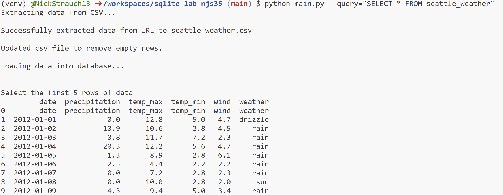

## Design Diagram
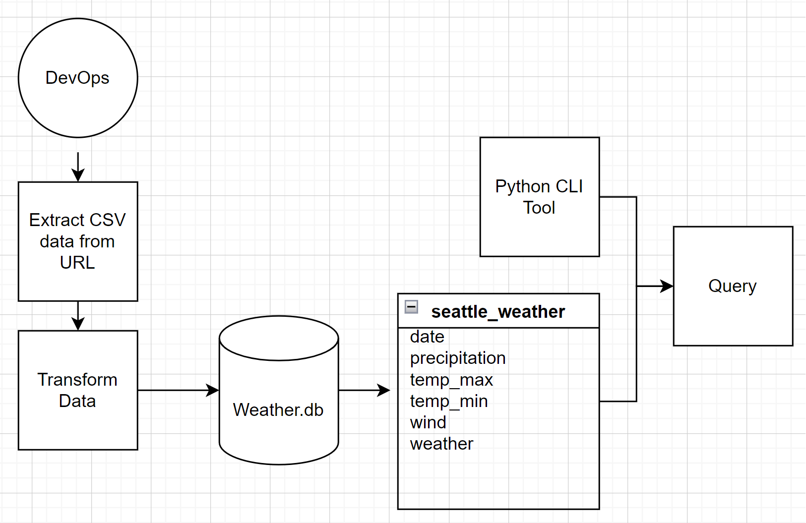

## Test Results
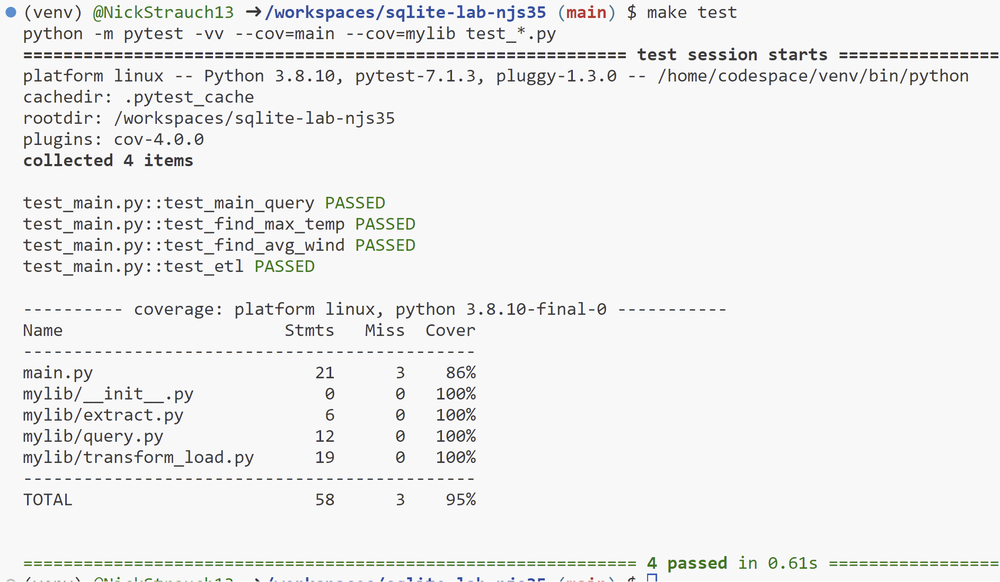

## Matrix Build Results
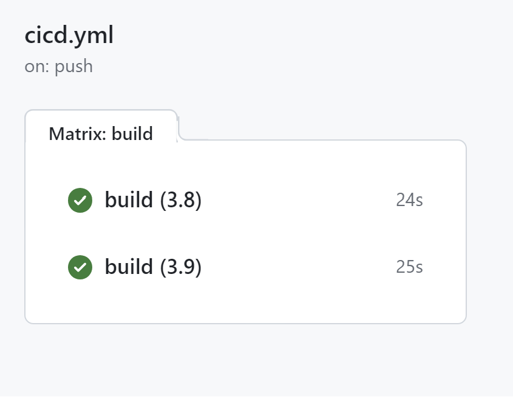
